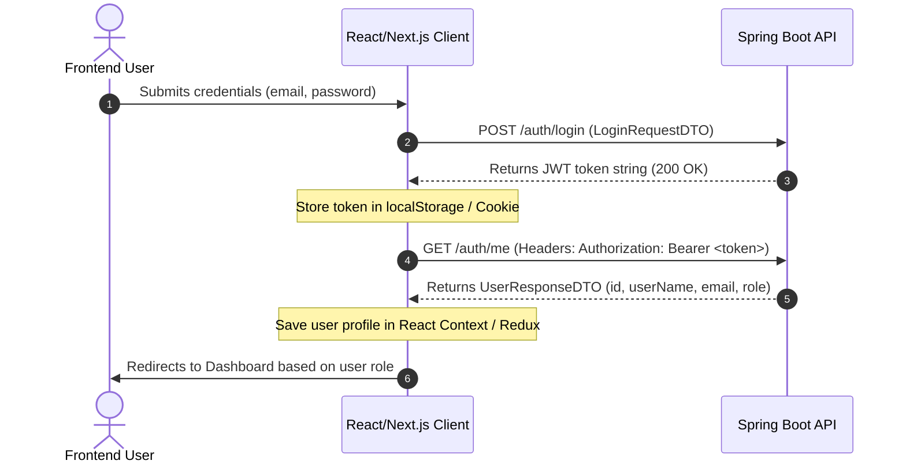

# 🚀 Frontend Integration Blueprint — HealthCare System

This guide outlines the application architecture, user flows, and endpoint wiring instructions to construct the frontend application connecting to the HealthCare Spring Boot backend.

---

## 🏗️ 1. Global Setup & Auth State Management

To authenticate requests, the frontend must capture the JWT string returned by the authentication endpoint and attach it to the `Authorization` header of all subsequent API calls.

### Axios / Fetch Interceptor Setup
Implement a global HTTP interceptor to automatically append the token:

```javascript
import axios from 'axios';

const api = axios.create({
  baseURL: 'http://localhost:8080', // Replace with backend URL
});

// Request Interceptor
api.interceptors.request.use((config) => {
  const token = localStorage.getItem('jwt_token');
  if (token) {
    config.headers.Authorization = `Bearer ${token}`;
  }
  return config;
}, (error) => {
  return Promise.reject(error);
});

// Response Interceptor for handling token expiry (HTTP 401)
api.interceptors.response.use(
  (response) => response,
  (error) => {
    if (error.response && error.response.status === 401) {
      // Clear token and redirect to login
      localStorage.removeItem('jwt_token');
      window.location.href = '/login';
    }
    return Promise.reject(error);
  }
);

export default api;
```

### Authentication Flow



---

## 🔑 2. Role-Based Route Protection

The backend strictly enforces endpoint authorization based on the user's role. The frontend must implement path guards to prevent UI rendering for unauthorized profiles.

> [!IMPORTANT]
> Always verify the role matches one of these values from the `UserRoles` enum:
> * `ADMIN`
> * `PATIENT`
> * `MEDECIN`
> * `SECRETAIRE`

### Route Mapping Grid

| Route | Authorized Roles | Primary Backend API Dependency |
|---|---|---|
| `/login` & `/register` | Anonymous | `POST /auth/login`, `POST /auth/register` |
| `/patient/dashboard` | `PATIENT` | `GET /rendezvous/patient/{id}`, `GET /medecin` |
| `/doctor/dashboard` | `MEDECIN` | `GET /dossier_medicale/patient/{id}`, `POST /consultation` |
| `/admin/dashboard` | `ADMIN` | `GET /patient`, `GET /medecin`, `GET /rendezvous` |

---

## 📱 3. Page-by-Page Integration Map

### Page A: Authentication (`/login` & `/register`)
* **Purpose**: Create profiles and request session tokens.
* **Forms Required**:
  1. **Login Form**: Controls for `email` and `password`.
  2. **Register Form**: Select field for user type (`PATIENT`, `MEDECIN`, `ADMIN`).
     * Show/hide sub-forms depending on the selection. If `PATIENT`, show fields for `nom`, `prenom`, `telephone`, and `dateNaissance`. If `MEDECIN`, show `nom`, `prenom`, and `specialite`.
* **API Wiring**:
  * Submit login → `POST /auth/login` (body: `LoginRequestDTO`).
  * Submit registration → `POST /auth/register` (body: `UserResquestDTO`).

### Page B: Patient Portal (`/patient/dashboard`)
* **Purpose**: Allows patients to manage bookings and browse doctors.
* **UI Widgets**:
  1. **Appointments Table**: Lists upcoming appointments with statuses (`PLANIFIE`, `ANNULE`, `TERMINE`). Include a **Cancel** button on active entries.
  2. **Booking Wizard**: Dropdown selector of doctors, calendar datetime picker, and a submit button.
* **API Wiring**:
  * Load appointments → `GET /rendezvous/patient/{patientId}`.
  * Load doctor catalog → `GET /medecin` (displays specialized doctors).
  * Book slot → `POST /rendezvous` (body: `RendezVousRequestDto` with `statut: "PLANIFIE"`).
  * Cancel booking → `PATCH /rendezvous/{id}?statut=ANNULE`.

### Page C: Practitioner Panel (`/doctor/dashboard`)
* **Purpose**: Allows doctors to view appointments, access patient history, and create consultation records.
* **UI Widgets**:
  1. **Schedule list**: Calendar or table listing today's bookings.
  2. **Dossier lookup**: Search input to query patient folders.
  3. **Observation sheet**: Input textareas for diagnostic and observations, with save buttons.
* **API Wiring**:
  * Load doctor's schedule → `GET /rendezvous/medecin/{doctorId}`.
  * Access patient's medical dossier → `GET /dossier_medicale/patient/{patientId}`.
  * Retrieve consultations → `GET /dossier_medicale/consultations/{dossierId}`.
  * Create medical record if missing → `POST /dossier_medicale` (body: `DossierMedicaleRequestDto`).
  * Record a new consultation → `POST /consultation` (body: `ConsultationRequestDto`).

### Page D: Admin Panel (`/admin/dashboard`)
* **Purpose**: Manage clinic directory and oversee all records.
* **UI Widgets**:
  1. **Medecins/Patients Lists**: Paginated tables listing users with full CRUD actions.
  2. **Schedule Overview**: Master dashboard listing all appointments across the system.
* **API Wiring**:
  * Load patients → `GET /patient/pagines?page=0&size=10`.
  * Load medecins → `GET /medecin/pagines?page=0&size=10`.
  * Create/Modify Doctors → `POST /medecin` or `PUT /medecin/{id}`.
  * Delete User → `DELETE /patient/{id}` or `DELETE /medecin/{id}`.

---

## 🗂️ 4. TypeScript Interfaces & DTO Schema Models

Use these TypeScript interface definitions matching the backend data shapes:

```typescript
export type UserRole = 'ADMIN' | 'PATIENT' | 'MEDECIN' | 'SECRETAIRE';
export type RendezVousStatus = 'PLANIFIE' | 'ANNULE' | 'TERMINE';

export interface UserResponseDTO {
  id: number;
  userName: string;
  email: string;
  role: UserRole;
}

export interface PatientResponseDto {
  id: number;
  nom: string;
  prenom: string;
  email: string;
  telephone: string;
  dateNaissance: string; // YYYY-MM-DD
  rendezVous?: RendezVousResponseDto[];
}

export interface MedecinResponseDto {
  id: number;
  nom: string;
  prenom: string;
  email: string;
  specialite: string;
  rendezVous?: RendezVousResponseDto[];
}

export interface RendezVousResponseDto {
  id: number;
  dateRendezVous: string; // ISO Datetime
  statut: RendezVousStatus;
  patientId: number;
  patientNom: string;
  patientPrenom: string;
  medecinId: number;
  medecinNom: string;
  medecinPrenom: string;
}

export interface DossierMedicaleResponseDto {
  id: number;
  dateCreation: string;
  patientId: number;
  patientNom: string;
  patientPrenom: string;
}

export interface ConsultationResponseDto {
  id: number;
  diagnostic: string;
  observation: string;
  date_consultation: string;
  dossierId: number;
  medecinId: number;
  medecinNom: string;
  medecinPrenom: string;
}
```

---

## 🔍 5. Interactive API Blueprint

You can open the interactive API blueprint locally to test payloads, view mock data, and explore endpoints step-by-step:
* Open [backend_api_report.html](file:///C:/Users/hamza2004/.gemini/antigravity-cli/brain/2036d304-dd37-4265-a9c9-e91c8816342f/backend_api_report.html) in your browser.
